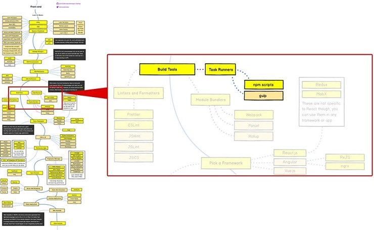

# Gulp for Beginners

(출처: [https://github.com/kamranahmedse/developer-roadmap](https://github.com/kamranahmedse/developer-roadmap))

Front-End Roadmap 2019 상 중간 즈음에 있는 Task Runners 중 Gulp를 학습합니다.  
대다수 블로그나 강좌들이 3.0을 기준으로 하고 있고 4.0에 대한 강의 내용을 찾기 어려워서 4.0을 기준으로 준비했습니다.

## 수업 자료

[Gulp for Beginners Repository](https://github.com/mulder21c/gulp-study) &mdash; 스터디 참여자만 접속 가능합니다.

- gitbook으로 작성된 문서가 제공됩니다.  
  해당 문서의 사용 방법은 위 저장소의 README에 안내 되어 있습니다.

## 학습 목표

- Task Runner에 대한 이해
- Gulp 4.0 기본 사용법 습득
- Gulp로 원하는 작업을 자동화 하기 위해 어떻게 해결해 가는지의 과정 학습

## 학습 대상

- task runner를 한 번도 접해보지 않은 이
- Gulp 설정을 직접 하는 것이 어려운 이
- 파일 저장할 때마다 브라우저 새로고침하기 귀찮고, Sass 컴파일을 어떻게 해야 할지도 모르겠고, 스프라이트 이미지는
  대체 왜 이렇게 만들기 귀찮고 노가다인지... 등등 귀찮은 작업들을 자동화 시키고 싶은 이
- 퍼블리싱 작업의 생산성을 좀 더 높여보고 싶은 웹 퍼블리셔 혹은 디자이너

## 필요 사전 지식

본 학습을 위해서는 아래와 같은 사전 지식 및 준비가 필요합니다.

- JavaScript

  최소한 function 작성 방법은 알고 있어야 합니다. (Gulp task를 function으로 작성합니다.)

  기본적인 ES 6 문법과 module에 대한 이해가 있다면, gulp를 이해하고 다루기가 좀 더 수월합니다.

- terminal이 통합된 IDE (optional, but recommended)

  terminal이 통합된 IDE가 없는 경우 손에 익은 에디터만 있어도 실습에는 문제가 없으나, 에디터와 터미널을 별도로
  열어두고 사용해야 합니다.

  설명을 위한 시연(?)은 Visual Studio Code(Git bash as integrated shell) for Windows로 이루어집니다.

- CLI (Command Line Interface)와 친해지기

  대다수의 명령이 CLI를 통해 이루어지기 때문에 CLI 사용에 대한 거부감이 없어야 합니다.  
  기본적인 terminal 명령어(`ls`, `cd` 등)를 알아두시면 좋습니다.

  간단한 terminal 명령어는 [Git CLI for Begginers &mdash; 필요 사전 지식](https://github.com/mulder21c/study-landing/tree/master/git#%ED%95%84%EC%9A%94-%EC%82%AC%EC%A0%84-%EC%A7%80%EC%8B%9D)에서 볼 수 있습니다.

- English와 친해지기

  너무나 당연하게(?) 영어로 된 기술문서를 읽는데 거부감이 없으셔야 합니다.  
  문제를 해결해 가는 과정에 영어 문서(매뉴얼)를 계속 찾아다닐 겁니다. 학습 자체에는 비중이 낮지만, 학습 이후
  실질적으로 개인이 활용하려면 결국 영문으로 된 매뉴얼을 읽으면서 해결하셔야 합니다.

## 스터디 내용

- 도입
  + 개요
  + Gulp란?
  + 실습 준비
- 설치
  + Node.js & NPM 설치
  + gulp-cli 설치
- Gulp 프로젝트 생성
  + package.json 파일 생성
  + Gulp 설치
  + gulpfile.js 파일 생성
  + ES6를 위한 설정
- Gulp 기초
  + 파일 다루기
  + globbing 설명
- Task 작성
  + 내보내기
  + task 조합
- Let's Practice
  + 로컬 웹서버 구동
  + HTML Linting Task - HTML 문법 검사 및 컨벤션 준수 검사 자동화
  + CSS Autoprefix Task - CSS Vendor prefix 생성 자동화
  + Minifying CSS Task - CSS 압축 자동화
  + Uglifying JavaScript Task - JavaScript 난독화 자동화
  + Sourcemap Task - 난독화 된 JavaScript의 sourcemap 생성
  + Pipe Breaking on Error - 오류 발생 시 gulp 중단 해결하기
  + SCSS Precompile Task - Sass/SCSS 컴파일 자동화
  + Automate Image Sprite - spriteimage 생성/적용 자동화
  + Optimzing Image Task - 이미지 최적화 자동화
  + Incremental Builds - 증분 빌드 구성
  + Clean Building Task - 최종 프로덕트 빌드 자동화
- Workshop (자유)
